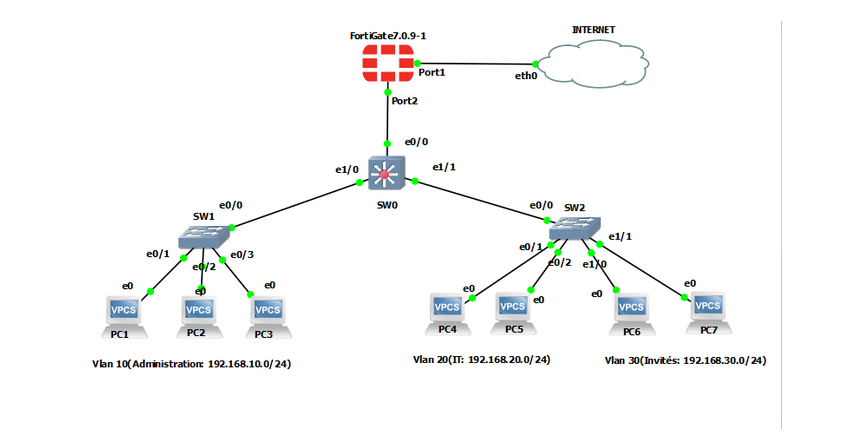

# Projet 2 – Sécurité avancée FortiGate : Policies, Profils, NAT & VIP

## 🧠 Contexte & Objectif

Ce projet simule une infrastructure d’entreprise avec VLANs segmentés,où il est nécessaire de **contrôler, inspecter et sécuriser le trafic interne**.
L’objectif est de démontrer la mise en place de **politiques avancées** sur FortiGate,l’application de **profils de sécurité**, et la configuration de **NAT/VIP** pour publier des services.

## 🧪 Scénario

Une entreprise doit :
- contrôler l’accès Internet depuis différents VLANs
- sécuriser le trafic interne avec des profils de sécurité (AV, Web Filter, IPS)
- publier un service interne accessible depuis l’extérieur via une IP publique (VIP)

## 🛠️ Technologies & concepts

- FortiGate (VM / GNS3)
- VLAN & segmentation réseau
- Switch Cisco
- Firewall Policies
- Security Profiles (AV, Web Filter, IPS)
- NAT & Virtual IP (VIP)

## 🧩 Architecture

## ⚙️ Étapes clés

1. Création des politiques firewall inter-VLAN
2. Application des profils de sécurité
3. Configuration du NAT sortant
4. Mise en place d’un VIP pour un service interne
5. Tests de sécurité et validation

## ✅ Résultats & validation

- Trafic autorisé uniquement selon les règles définies
- Inspection du trafic par les profils de sécurité
- Accès Internet fonctionnel et sécurisé
- Service interne accessible depuis l’extérieur via VIP

## 🎯 Compétences démontrées

- Conception et sécurisation d’un réseau interne segmenté
- Configuration avancée de FortiGate via interface graphique
- Application de politiques et profils de sécurité
- Publication sécurisée de services internes via NAT / VIP

## 📂 Contenu du dossier

- `architecture.png` – Schéma réseau
- `config-FortiGate.pdf` – Captures de configuration FortiGate
- `Lab FortiGate – Sécurité avancée _ policies, profils de sécurité, NAT, VIP  – Partie 2.pdf` – Documentation complète du lab

📄 *Si le PDF ne s’affiche pas directement sur GitHub, veuillez le télécharger pour le consulter.*
