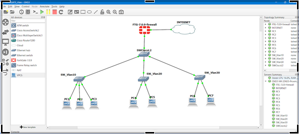

# Lab 1 – VLAN & segmentation réseau sur FortiGate

## 🧠 Contexte & Objectif
Ce lab simule une infrastructure d’entreprise nécessitant une **segmentation réseau**
afin d’améliorer la **sécurité**, l’**isolation des flux** et la **gestion des accès internes**.
L’objectif est de démontrer la mise en œuvre des VLANs sur FortiGate et leur intégration
avec un switch Cisco de niveau 2.

## 🧪 Scénario
Une entreprise souhaite segmenter son réseau interne en plusieurs VLANs
(utilisateurs, administration, serveurs, etc.) tout en centralisant le routage
et la sécurité sur un firewall FortiGate.

## 🛠️ Technologies & concepts
- FortiGate (VM / GNS3)
- VLAN & segmentation réseau
- Switch Cisco Layer 2
- Routage statique
- Sécurité réseau

## 🧩 Architecture

## ⚙️ Étapes clés 
1. Création des VLANs sur le FortiGate
2. Configuration des VLANs sur le switch Cisco
3. Mise en place du routage statique
4. Attribution automatique des adresses IP aux postes clients
5. Tests de connectivité inter-VLAN

## ✅ Résultats & validation
- Segmentation réseau fonctionnelle
- Isolation des VLANs selon les règles définies
- Attribution correcte des adresses IP par VLAN
- Communication contrôlée entre les segments réseau

## 🎯 Compétences démontrées
- Conception d’une architecture réseau segmentée
- Configuration FortiGate via interface graphique
- Intégration firewall ↔ switch Cisco
- Analyse et validation du fonctionnement réseau

## 📂 Contenu du dossier
- `architecture.png` – Schéma de l’architecture réseau
- `config-FortiGate.pdf` – Captures d’écran de la configuration FortiGate
- `config-Switches.pdf` – Captures d’écran de la configuration Switch Cisco
- `Mise en place d’un lab FortiGate sur GNS3 – VLAN & segmentation réseau.pdf` – Documentation complète du lab
- `Rapport de Diagnostic VLAN.pdf` – Analyse et diagnostic du projet

📄 *Si les fichiers PDF ne s’affichent pas directement dans GitHub, veuillez les télécharger pour les consulter.*
