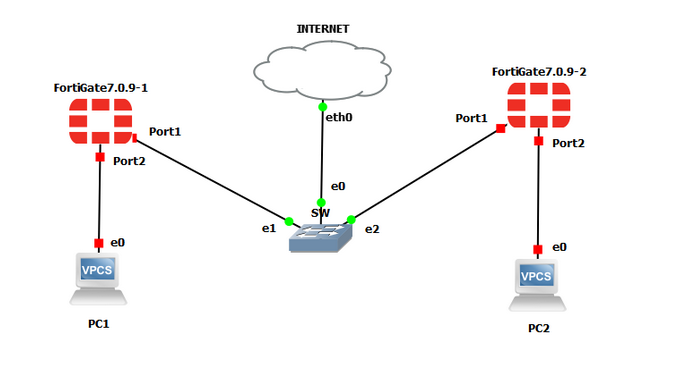

# Projet 3 – VPN Site-to-Site FortiGate

## 🧠 Contexte & Objectif

Ce projet simule une infrastructure d’entreprise avec deux sites distants,où il est nécessaire de **connecter et sécuriser les communications inter-sites**.
L’objectif est de démontrer la mise en place d’un **tunnel VPN IPsec site-à-site** entre deux FortiGate, avec gestion des flux et routage sécurisé.

## 🧪 Scénario

Deux sites distants possèdent chacun un FortiGate. Les réseaux internes doivent pouvoir communiquer de manière sécurisée via un tunnel VPN IPsec, tout en isolant les réseaux non autorisés.

## 🛠️ Technologies & concepts

- FortiGate (VM / GNS3)
- VPN IPsec Site-to-Site
- Phase 1 / Phase 2
- Firewall Policies
- Routage (statique ou dynamique)

## 🧩 Architecture

## ⚙️ Étapes clés

1. Configuration Phase 1 IPsec
2. Configuration Phase 2 IPsec
3. Création des policies firewall
4. Configuration du routage
5. Tests de connectivité inter-sites

## ✅ Résultats & validation

- Tunnel VPN IPsec opérationnel
- Communication sécurisée entre les deux sites
- Isolation des réseaux non autorisés
- Flux réseau validés et testés

## 🎯 Compétences démontrées

- Conception et sécurisation d’un VPN site-à-site
- Configuration FortiGate IPsec Phase 1 et Phase 2
- Création de policies firewall inter-sites
- Gestion du routage et contrôle des flux réseau
- Compréhension des architectures réseau sécurisées pour entreprise

## 📂 Contenu du dossier

- `architecture.png` – Schéma VPN Site-to-Site
- `config-FortiGate-SiteA.pdf` – Configuration Site A
- `config-FortiGate-SiteB.pdf` – Configuration Site B
- `Lab FortiGate – Déploiement d’un VPN Site-to-Site IPsec - Partie 3.pdf` – Documentation complète du lab

📄 *Si le PDF ne s’affiche pas directement sur GitHub, veuillez le télécharger pour le consulter.*
